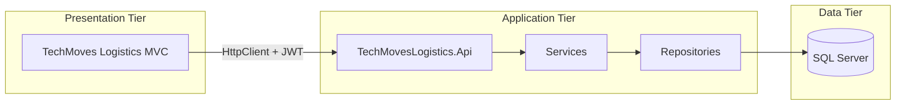

# TechMoves Logistics (GLMS)

Global Logistics Management System for **TechMoves Logistics** — an enterprise logistics application built with ASP.NET Core 10. The solution follows a **service-oriented architecture (SOA)**: a dedicated REST Web API owns all database access, the MVC web app consumes the API via `HttpClient`, endpoints are secured with **JWT bearer authentication**, and the full stack runs locally or in **Docker Compose** with automated **GitHub Actions** CI.

**Module context:** PROG7311 — Enterprise Application Development (Part 3 POE)

---

## Table of Contents

- [Features](#features)
- [Architecture](#architecture)
- [Solution Structure](#solution-structure)
- [Technology Stack](#technology-stack)
- [Prerequisites](#prerequisites)
- [Quick Start — Docker (recommended)](#quick-start--docker-recommended)
- [Local Development Setup](#local-development-setup)
- [Authentication](#authentication)
- [REST API](#rest-api)
- [Database & Migrations](#database--migrations)
- [Testing](#testing)
- [CI/CD](#cicd)
- [Configuration](#configuration)
- [Troubleshooting](#troubleshooting)

---

## Features

### Client Management
- Full CRUD for clients (name, contact details, region)
- One-to-many relationship with contracts

### Contract Management
- Create and manage service contracts linked to clients
- Contract periods (start/end dates) and service levels
- Status lifecycle: **Draft**, **Active**, **Expired**, **OnHold**
- Search/filter by date range and status
- Upload and download signed agreement PDFs

### Service Request Management
- Create requests under active contracts
- Status tracking: **Pending**, **InProgress**, **Completed**, **Cancelled**
- Business rule: requests blocked when contract is **Expired** or **OnHold**
- Multi-currency cost tracking (ZAR and USD) with exchange rate snapshot

### Currency Conversion
- Live USD → ZAR rate via ExchangeRate-API
- Fallback rate when the external API is unavailable

### Security & SOA
- JWT-secured REST API (`[Authorize]` on protected controllers)
- MVC login stores token in session; `JwtAuthorizationHandler` attaches Bearer token to API calls
- Presentation tier has **no** EF Core or database connection strings

---

## Architecture



| Tier | Project | Responsibility |
|------|---------|----------------|
| Presentation | `TechMoves Logistics` | Razor MVC UI, session login, typed API clients |
| Application | `TechMovesLogistics.Api` | REST endpoints, JWT auth, Swagger, EF migrations |
| Shared core | `TechMovesLogistics.Core` | Models, `ApplicationDbContext`, repositories, services |
| Tests | `TechMovesLogistics.Tests` | Unit tests + 18 integration tests |

**Design patterns:** Repository pattern, service layer, dependency injection, DTOs for API responses.

---

## Solution Structure

```
TechMoves Logistics/
├── TechMovesLogistics.slnx              # Solution file
├── docker-compose.yml                   # Full stack orchestration
├── .env.example                         # Docker environment template (copy to .env)
├── .github/workflows/
│   ├── unit-tests.yml                   # Unit tests on push/PR
│   ├── integration-tests.yml            # Integration tests + SQL Server container
│   └── docker-build.yml                 # Validates Dockerfiles build
├── docs/
│   └── Technical-Reflection-PROG7311-Part3.docx
│
├── TechMovesLogistics.Api/              # REST Web API (owns DB)
│   ├── Controllers/                     # Auth, Clients, Contracts, ServiceRequests, Currency
│   ├── Dtos/                            # Request/response DTOs
│   ├── Migrations/                      # EF Core migrations (source of truth)
│   ├── Services/                        # JwtTokenService
│   ├── Dockerfile
│   └── Program.cs                       # JWT, EF Core, Swagger, auto-migrate on startup
│
├── TechMoves Logistics/                 # MVC frontend (no database access)
│   ├── Controllers/                     # MVC controllers → API clients only
│   ├── Services/                        # *ApiClient implementations, JWT handler
│   ├── Filters/                         # ApiExceptionFilter
│   ├── Views/
│   ├── Dockerfile
│   └── Program.cs                       # HttpClient, session, cookie auth
│
├── TechMovesLogistics.Core/             # Shared domain & data layer
│   ├── Models/                          # Client, Contract, ServiceRequest, enums
│   ├── Data/                            # ApplicationDbContext
│   ├── Repositories/                    # EF Core data access
│   └── Services/                        # Business logic
│
└── TechMovesLogistics.Tests/
    ├── ContractServiceTests.cs          # Unit tests
    ├── CurrencyServiceTests.cs
    ├── FileServiceTests.cs
    ├── ServiceRequestServiceTests.cs
    └── Integration/                     # 18 API integration tests
        ├── ApiWebApplicationFactory.cs
        ├── AuthApiIntegrationTests.cs
        ├── ClientsApiIntegrationTests.cs
        ├── ContractsApiIntegrationTests.cs
        ├── ServiceRequestsApiIntegrationTests.cs
        └── CurrencyApiIntegrationTests.cs
```

---

## Technology Stack

| Area | Technology |
|------|------------|
| Framework | ASP.NET Core 10, C# |
| Web UI | ASP.NET Core MVC (Razor) |
| API | ASP.NET Core Web API, Swagger / OpenAPI (Swashbuckle 10) |
| Auth | JWT Bearer (RFC 7519), cookie session on MVC |
| Database | SQL Server (LocalDB dev / containerised in Docker) |
| ORM | Entity Framework Core 10 (API + Core only) |
| HTTP client | `IHttpClientFactory`, typed API clients |
| Containers | Docker multi-stage builds, Docker Compose |
| Testing | xUnit, `WebApplicationFactory`, Moq |
| CI | GitHub Actions |

---

## Prerequisites

- [.NET 10 SDK](https://dotnet.microsoft.com/download)
- [Docker Desktop](https://www.docker.com/products/docker-desktop/) (for containerised run)
- **SQL Server LocalDB** or SQL Server Express (for local dev / integration tests)
- Visual Studio 2022+ or VS Code with C# extension
- Git

---

## Quick Start — Docker (recommended)

### 1. Clone and configure

```powershell
git clone <repository-url>
cd "TechMoves Logistics"
copy .env.example .env
```

Edit `.env` if needed (defaults work for local Docker).

### 2. Start the stack

```powershell
docker compose up --build
```

### 3. Access the application

| Service | URL |
|---------|-----|
| **MVC web app** | http://localhost:8081 |
| **REST API (Swagger)** | http://localhost:8080/swagger |
| **SQL Server** | `localhost:1433` (SA password from `.env`) |

### 4. Log in

| Field | Value |
|-------|-------|
| Username | `admin` |
| Password | `Admin@123` |

### Docker services

| Container | Role |
|-----------|------|
| `sql-server-db` | SQL Server 2022, persistent volume |
| `glms-backend-api` | REST API on port 8080, runs EF migrations on startup |
| `glms-frontend-web` | MVC app on port 8081, calls API via `http://glms-backend-api:8080` |

---

## Local Development Setup

Run **both** the API and MVC projects. The MVC app calls the API using `ApiSettings:BaseUrl`.

### 1. Restore and build

```powershell
dotnet restore TechMovesLogistics.slnx
dotnet build TechMovesLogistics.slnx
```

### 2. Apply database migrations (API project)

```powershell
dotnet ef database update --project TechMovesLogistics.Api --startup-project TechMovesLogistics.Api
```

### 3. Start the API

```powershell
dotnet run --project TechMovesLogistics.Api
```

Swagger: **https://localhost:7216/swagger**

### 4. Start the MVC app (second terminal)

Ensure `TechMoves Logistics/appsettings.json` points to the API:

```json
"ApiSettings": {
  "BaseUrl": "https://localhost:7216"
}
```

```powershell
dotnet run --project "TechMoves Logistics"
```

MVC app: **https://localhost:7006**

### Visual Studio — multiple startup projects

1. Right-click solution → **Properties** → **Startup Project**
2. Select **Multiple startup projects**
3. Set **TechMovesLogistics.Api** and **TechMoves Logistics** both to **Start**
4. Press **F5**

---

## Authentication

### MVC (browser)
1. Navigate to `/Account/Login`
2. Enter `admin` / `Admin@123`
3. Session stores the JWT; all API calls include `Authorization: Bearer <token>`

### Swagger
1. Call `POST /api/auth/login` with the credentials above
2. Copy the `token` from the response
3. Click **Authorize** (top right) → paste the token only → **Authorize**

Protected endpoints return **401 Unauthorized** without a valid token.

---

## REST API

Base path: `/api`

| Controller | Key endpoints |
|------------|---------------|
| **Auth** | `POST /api/auth/login` |
| **Clients** | `GET`, `POST`, `GET/{id}`, `PUT/{id}`, `DELETE/{id}` |
| **Contracts** | `GET` (filters), `POST`, `GET/{id}`, `PUT/{id}`, `PATCH/{id}/status`, `DELETE/{id}`, agreement upload/download |
| **ServiceRequests** | Full CRUD under `/api/servicerequests` |
| **Currency** | `GET /api/currency/usd-zar` |

**HTTP status codes:** 200, 201, 204, 400, 401, 404 as appropriate.

Controllers delegate to services/repositories in `TechMovesLogistics.Core`; DTOs prevent circular JSON serialisation.

---

## Database & Migrations

- **Owner:** `TechMovesLogistics.Api` (connection string in `TechMovesLogistics.Api/appsettings.json`)
- **Migrations folder:** `TechMovesLogistics.Api/Migrations/`
- **Docker:** migrations applied automatically on API startup via `Database.Migrate()`
- **Integration tests:** separate test database `TechMovesLogisticsDB_Test` on LocalDB

### Create a new migration

```powershell
dotnet ef migrations add <MigrationName> --project TechMovesLogistics.Api --startup-project TechMovesLogistics.Api
dotnet ef database update --project TechMovesLogistics.Api --startup-project TechMovesLogistics.Api
```

### Schema overview

| Table | Purpose |
|-------|---------|
| **Clients** | Client master data |
| **Contracts** | Linked to clients; status, dates, service level, PDF path |
| **ServiceRequests** | Linked to contracts; costs, currency, status |

---

## Testing

### Run all tests

```powershell
dotnet test TechMovesLogistics.Tests
```

### Unit tests only

```powershell
dotnet test TechMovesLogistics.Tests --filter "FullyQualifiedName!~Integration"
```

### Integration tests only (18 tests)

Requires LocalDB. Uses `WebApplicationFactory` to boot the API in-process.

```powershell
dotnet test TechMovesLogistics.Tests --filter "FullyQualifiedName~Integration"
```

Or use **Visual Studio Test Explorer** → filter by `Integration` → Run All.

Integration tests cover:
- Authenticated CRUD and filtering on contracts/clients
- Business rules (e.g. service request on expired contract → 400)
- Auth (login success, unauthorised → 401)
- Currency endpoint

---

## CI/CD

GitHub Actions workflows in `.github/workflows/`:

| Workflow | Trigger | Purpose |
|----------|---------|---------|
| `unit-tests.yml` | Push / PR | Builds solution, runs unit tests |
| `integration-tests.yml` | Push / PR | SQL Server 2022 service container, runs 18 integration tests |
| `docker-build.yml` | Push / PR | Builds API and MVC Dockerfiles (no push to registry) |

View results under the **Actions** tab on GitHub.

---

## Configuration

### MVC — `TechMoves Logistics/appsettings.json`

| Key | Purpose |
|-----|---------|
| `ApiSettings:BaseUrl` | REST API base URL (local or Docker internal URL) |

### API — `TechMovesLogistics.Api/appsettings.json`

| Key | Purpose |
|-----|---------|
| `ConnectionStrings:DefaultConnection` | SQL Server connection |
| `Jwt:Key`, `Jwt:Issuer`, `Jwt:Audience` | JWT signing and validation |
| `Auth:Username`, `Auth:Password` | Login credentials |
| `CurrencyApi:BaseUrl` | Exchange rate API endpoint |

### Docker — `.env` (from `.env.example`)

| Variable | Purpose |
|----------|---------|
| `MSSQL_SA_PASSWORD` | SQL Server SA password |
| `DB_SERVER`, `DB_NAME` | Database host and name |
| `JWT_KEY`, `JWT_ISSUER`, `JWT_AUDIENCE` | JWT configuration |
| `AUTH_USERNAME`, `AUTH_PASSWORD` | API login |
| `API_INTERNAL_URL` | MVC → API URL inside Docker network |
| `CURRENCY_API_BASE_URL` | External currency API |

---

## Troubleshooting

### Swagger returns 401
Log in via `POST /api/auth/login`, then use **Authorize** with the JWT token.

### MVC cannot reach API locally
- Confirm the API is running on `https://localhost:7216`
- Check `ApiSettings:BaseUrl` in MVC `appsettings.json`
- Trust the dev HTTPS certificate if needed: `dotnet dev-certs https --trust`

### Docker containers fail to start
```powershell
docker compose down
docker compose up --build
docker compose logs glms-backend-api
```
Ensure port **8080**, **8081**, and **1433** are not in use.

### Integration test database errors
- Confirm SQL Server LocalDB is installed
- Run integration tests sequentially (shared collection fixture handles DB reset)
- Close other test runs that may lock `TechMovesLogisticsDB_Test`

### Apply Swagger Authorize button fix
If **Authorize** is missing, rebuild the API container:
```powershell
docker compose up --build glms-backend-api
```

---

## Documentation

- **Part 3 progress tracker:** `PART3-PROGRESS.md`
- **Technical reflection:** `docs/Technical-Reflection-PROG7311-Part3.docx`

---

**Built with ASP.NET Core 10 — TechMoves Logistics (PROG7311 Part 3)**
